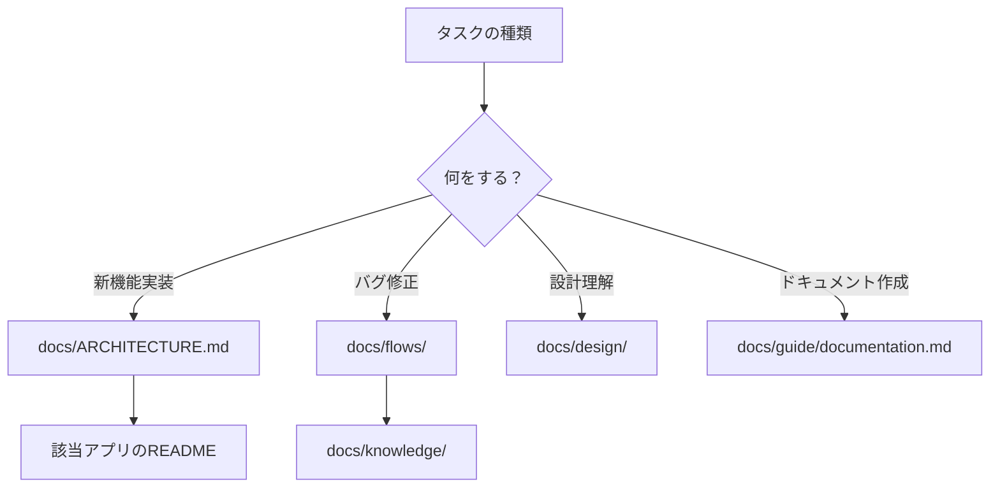

# CLAUDE.md

このファイルはClaude Codeがこのリポジトリで作業する際のガイドラインです。

## TL;DR - 目的別クイックナビゲーション

| 目的 | 参照先 | 所要時間 |
|------|--------|---------|
| 新機能を実装 | [docs/ARCHITECTURE.md](docs/ARCHITECTURE.md) → 該当アプリのREADME | 15分 |
| バグを修正 | [docs/flows/](docs/flows/) → [docs/knowledge/](docs/knowledge/) | 10分 |
| 設計を理解 | [docs/ARCHITECTURE.md](docs/ARCHITECTURE.md) → [docs/design/](docs/design/) | 20分 |
| ドキュメントを書く | [docs/guide/documentation.md](docs/guide/documentation.md) | 10分 |
| コードレビュー | (準備中) | - |



## 言語設定

- **回答**: 日本語で返答すること
- **コード内コメント**: 英語のまま
- **技術用語**: 英語のまま（無理に翻訳しない）

## プロジェクト構造

このリポジトリはモノレポ構成です：

```
wsl-claude-commander/
├── apps/                     # アプリケーション
│   ├── voice-input/          # 音声入力アプリ
│   ├── voice-output/         # 音声出力アプリ
│   └── window-manager/       # ウィンドウ管理アプリ
├── packages/                 # 共有パッケージ
│   ├── shared/               # 共有ライブラリ
│   └── config/               # 共通設定
└── docs/                     # ドキュメント
```

## ドキュメント構成

### Knowledge Base

ドキュメントは以下のディレクトリに分類されています：

| ディレクトリ | 内容 | 優先度 |
|------------|------|--------|
| [docs/knowledge/](docs/knowledge/) | 実践的知識（HOW） | ⭐⭐⭐ 必読 |
| [docs/design/](docs/design/) | 設計思想（WHY） | ⭐⭐ 理解推奨 |
| [docs/references/](docs/references/) | 外部仕様（WHAT） | ⭐ 必要時参照 |
| [docs/flows/](docs/flows/) | 処理フロー | ⭐⭐⭐ 実装時必須 |
| [docs/testing/](docs/testing/) | テストガイド | ⭐⭐ 実装後必須 |
| [docs/guide/](docs/guide/) | 開発ガイドライン | ⭐⭐ 理解推奨 |

### ドキュメント作成ガイド

新しいドキュメントを作成する際は、必ず [docs/guide/documentation.md](docs/guide/documentation.md) を参照してください。

**重要なポイント**:
- 1ファイル = 1,000-2,000行以内
- Frontmatter（title, category, tags, related）を必ず設定
- 相互リンクは3-5個を目安
- Mermaid図で視覚化

## コーディングガイドライン

### 一般原則

1. **既存パターンに従う**: 新しいパターンを導入する前に、既存コードのパターンを確認
2. **シンプルに保つ**: 過度な抽象化を避ける
3. **コメントは「なぜ」を書く**: 「何を」ではなく「なぜそうしたか」を説明

### ファイル命名規則

- **アプリケーション**: `apps/{app-name}/`
- **共有パッケージ**: `packages/{package-name}/`
- **ドキュメント**: `docs/{category}/{feature-name}.md`
- **フロードキュメント**: `docs/flows/{app-name}/{feature-name}.md`

## コミットメッセージ

```
{type}: {簡潔な説明}

{詳細な説明（必要に応じて）}

Co-Authored-By: Claude Opus 4.5 <noreply@anthropic.com>
```

**type の種類**:
- `feat`: 新機能
- `fix`: バグ修正
- `docs`: ドキュメント
- `refactor`: リファクタリング
- `test`: テスト
- `chore`: その他

## 開発フロー

1. **タスクを理解**: 関連するドキュメントを読む
2. **設計を確認**: `docs/design/` で設計思想を確認
3. **実装**: 既存パターンに従って実装
4. **テスト**: テストを作成・実行
5. **ドキュメント更新**: 必要に応じてドキュメントを更新

## 関連ドキュメント

- [docs/README.md](docs/README.md) - ドキュメント全体のインデックス
- [docs/ARCHITECTURE.md](docs/ARCHITECTURE.md) - システムアーキテクチャ
- [docs/guide/documentation.md](docs/guide/documentation.md) - ドキュメント作成ガイド
