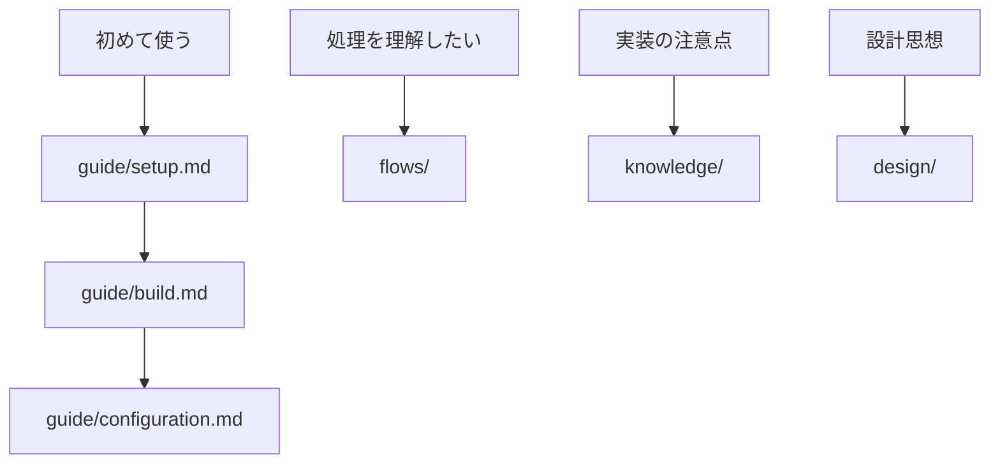

# wsl-multi-launcher ドキュメント

WSLマルチウィンドウランチャーの技術ドキュメント。

## クイックナビゲーション

## ディレクトリ構造

| ディレクトリ | 目的 | 優先度 |
|-------------|------|--------|
| [guide/](./guide/) | 開発ガイドライン、セットアップ手順 | ⭐⭐⭐ 必読 |
| [flows/](./flows/) | 処理フロー、シーケンス図 | ⭐⭐ 実装時参照 |
| [knowledge/](./knowledge/) | 実装ノウハウ、トラブルシューティング | ⭐⭐ 実装時参照 |
| [design/](./design/) | 設計判断、アーキテクチャ | ⭐ 詳細が必要な場合 |
| [references/](./references/) | 外部API仕様、ライブラリドキュメント | ⭐ 詳細が必要な場合 |

## 推奨する読み順

### 初めて開発する場合

1. **[環境構築ガイド](./guide/setup.md)** - 開発環境のセットアップ
2. **[ビルドガイド](./guide/build.md)** - ビルドとテスト実行
3. **[設定ガイド](./guide/configuration.md)** - 設定ファイルの書き方

### 機能を理解したい場合

1. **[Launch処理フロー](./flows/launch-flow.md)** - ウィンドウ起動・配置の処理フロー
2. **[ウィンドウ追跡戦略](./design/window-tracking-strategy.md)** - 設計判断とトレードオフ

### 実装時の注意点

1. **[ウィンドウハンドル追跡](./knowledge/window-handle-tracking.md)** - ハンドルベース追跡の実装ノウハウ

## 関連ドキュメント

- [README.md](../README.md) - プロジェクト概要
- [ROADMAP.md](../ROADMAP.md) - 開発ロードマップ
