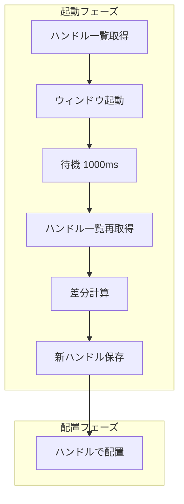

# ウィンドウ追跡戦略

## 設計の背景

### 課題

WSLウィンドウを起動後、特定のディスプレイに自動配置するには、
「どのウィンドウを配置するか」を正確に識別する必要がある。

Windows Terminalは以下の特性を持つ：
- 複数のウィンドウ/タブをサポート
- ウィンドウタイトルはシェルやコマンドに依存
- `--title` オプションの動作が不安定

### 要件

1. 新しく起動したウィンドウを確実に識別
2. 複数ウィンドウの同時追跡
3. 起動順序と配置位置の対応付け

## アーキテクチャ概要



## 設計判断

### なぜハンドルベースか

**採用理由**:
- ウィンドウを一意に識別可能
- タイトルやプロセス名に依存しない
- Windows APIで直接操作可能

**タイトルベースを却下した理由**:
- Windows Terminalの `--title` オプションが不安定
- cmd.exe経由でエスケープシーケンスが文字化け
- 同名タイトルのウィンドウが複数存在する可能性

### なぜ差分方式か

**採用理由**:
- 起動前後の状態比較で新ウィンドウを特定
- プロセスIDの追跡が不要
- シンプルで堅牢

**プロセスID追跡を却下した理由**:
- Windows Terminalは単一プロセスで複数ウィンドウ
- wt.exeの起動とウィンドウ作成が非同期
- プロセスからウィンドウへのマッピングが複雑

## トレードオフ

| 利点 | 欠点 |
|-----|-----|
| タイトル設定が不要 | 待機時間が必要（1000ms/ウィンドウ） |
| 確実にウィンドウを識別 | 同時に複数ウィンドウが開くと混乱 |
| Windows APIを直接使用 | PowerShellスクリプトが必要 |
| シンプルな差分計算 | 外部からウィンドウが開かれると誤検出 |

## 代替案

### 案1: タイトルベース検索

```
wt.exe --title "window-1" wsl.exe ...
move_window("window-1", rect)
```

**却下理由**: `--title` オプションが動作しない

### 案2: プロセスID追跡

```
pid = launch_wt()
hwnd = find_window_by_pid(pid)
```

**却下理由**: wt.exeは既存プロセスにウィンドウを追加するため、PIDが役立たない

### 案3: ウィンドウ列挙 + 作成時刻

```
windows = get_all_wt_windows()
newest = windows.sort_by_creation_time().last()
```

**却下理由**: Windows APIでウィンドウ作成時刻を取得する方法がない

### 案4: 採用案 - 差分ベース追跡

```
before = get_handles()
launch()
after = get_handles()
new = after - before
```

**採用理由**: シンプルで確実、追加APIが不要

## 実装上の注意

### 待機時間の調整

- 短すぎる: ウィンドウが検出されない
- 長すぎる: 起動時間が増加
- 推奨: 1000ms（調整可能にすることを検討）

### 並行起動の制限

現在の実装は順次起動を前提としている。
並行起動する場合は、ハンドル追跡のロジックを変更する必要がある。

## 関連ドキュメント

- [Knowledge: ウィンドウハンドル追跡](../knowledge/window-handle-tracking.md)
- [Flow: Launch処理フロー](../flows/launch-flow.md)
