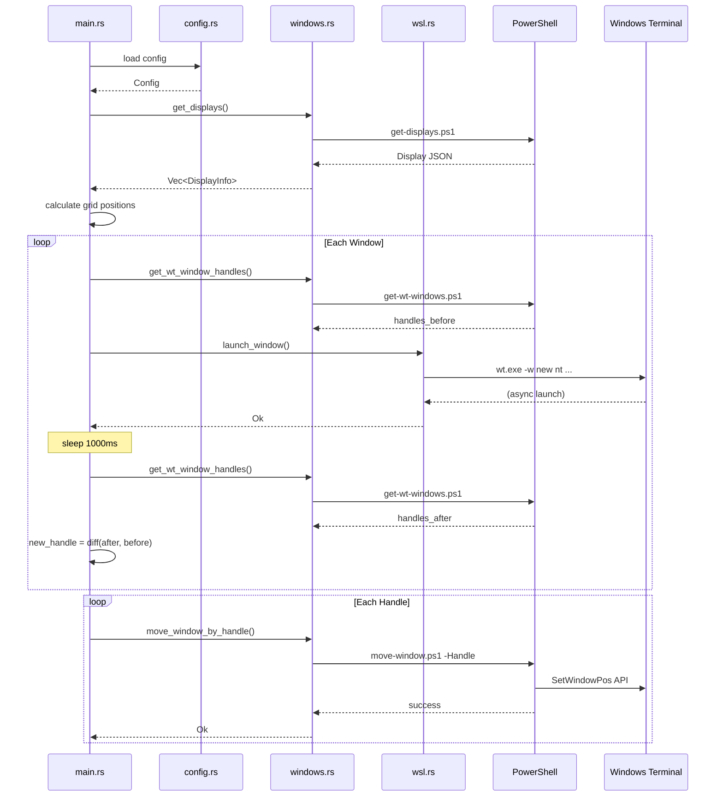

# Launch処理フロー

## 概要

`wsl-multi-launcher launch` コマンドの処理フロー。
設定ファイルを読み込み、WSLウィンドウを起動し、指定されたディスプレイにグリッド配置する。

## 入口

- **トリガー**: `wsl-multi-launcher launch` コマンド実行
- **ファイル**: `src/main.rs:131`

## 呼び出し順序

1. `load_config_with_helpful_error()` - `src/main.rs:369`
2. `config.layout.parse_grid()` - `src/config.rs`
3. `windows::get_displays()` - `src/windows.rs:48`
4. `windows::get_display_working_area()` - `src/windows.rs:91`
5. `layout::GridLayout::new()` - `src/layout.rs`
6. `grid.calculate_all_positions()` - `src/layout.rs`
7. ループ: 各ウィンドウに対して
   - `windows::get_wt_window_handles()` - `src/windows.rs:166`
   - `launcher.launch_window()` - `src/wsl.rs:21`
   - `windows::get_wt_window_handles()` - `src/windows.rs:166`
   - 差分計算でハンドル特定
8. ループ: 配置
   - `windows::move_window_by_handle()` - `src/windows.rs:206`

## シーケンス図



## 関連ファイル

| ファイル | 役割 |
|---------|------|
| `src/main.rs` | CLIエントリーポイント、launchコマンド処理 |
| `src/config.rs` | 設定ファイル読み込み・検証 |
| `src/wsl.rs` | WSLウィンドウ起動 |
| `src/windows.rs` | ディスプレイ情報取得、ウィンドウ配置 |
| `src/layout.rs` | グリッドレイアウト計算 |
| `scripts/get-displays.ps1` | ディスプレイ情報取得 |
| `scripts/get-wt-windows.ps1` | Windows Terminalハンドル取得 |
| `scripts/move-window.ps1` | ウィンドウ移動 |

## 観測点（デバッグ用）

| 観測点 | ファイル:行 | 確認内容 |
|--------|------------|---------|
| 設定読み込み後 | `main.rs:133` | grid, windows数 |
| ディスプレイ取得後 | `main.rs:146` | ディスプレイ情報 |
| ハンドル取得後 | `main.rs:198` | 新しいハンドル |
| 配置後 | `main.rs:226` | 配置成否 |

`-v` オプションでdebugログを有効化：
```bash
./target/release/wsl-multi-launcher -v launch
```

## 補足事項

### タイミングの重要性

- ウィンドウ起動後、ハンドル取得まで1000msの待機が必要
- 待機時間が短いと、新しいウィンドウが検出されない
- 待機時間が長いと、全体の起動時間が増加

### エラー時の動作

- ハンドル取得失敗: 警告を出して次のウィンドウへ
- 配置失敗: 警告を出して次のウィンドウへ
- 設定エラー: 即座に終了

## 関連ドキュメント

- [Knowledge: ウィンドウハンドル追跡](../knowledge/window-handle-tracking.md)
- [Design: ウィンドウ追跡戦略](../design/window-tracking-strategy.md)
- [Guide: 設定ファイル](../guide/configuration.md)
