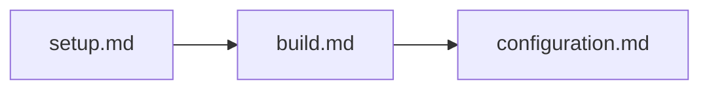

# ガイド

wsl-multi-launcherの開発・利用ガイド。

## ドキュメント一覧

| ファイル | 内容 | 優先度 |
|---------|------|--------|
| [setup.md](./setup.md) | 環境構築ガイド | ⭐⭐⭐ 必読 |
| [build.md](./build.md) | ビルド・テスト実行 | ⭐⭐⭐ 必読 |
| [configuration.md](./configuration.md) | 設定ファイルの書き方 | ⭐⭐⭐ 必読 |

## 推奨する読み順

1. **環境構築** - 必要なツールをインストール
2. **ビルド** - プロジェクトをビルドして動作確認
3. **設定** - 自分の環境に合わせて設定をカスタマイズ

## 関連ドキュメント

- [../README.md](../README.md) - ドキュメントトップ
- [../flows/](../flows/) - 処理フローの詳細
