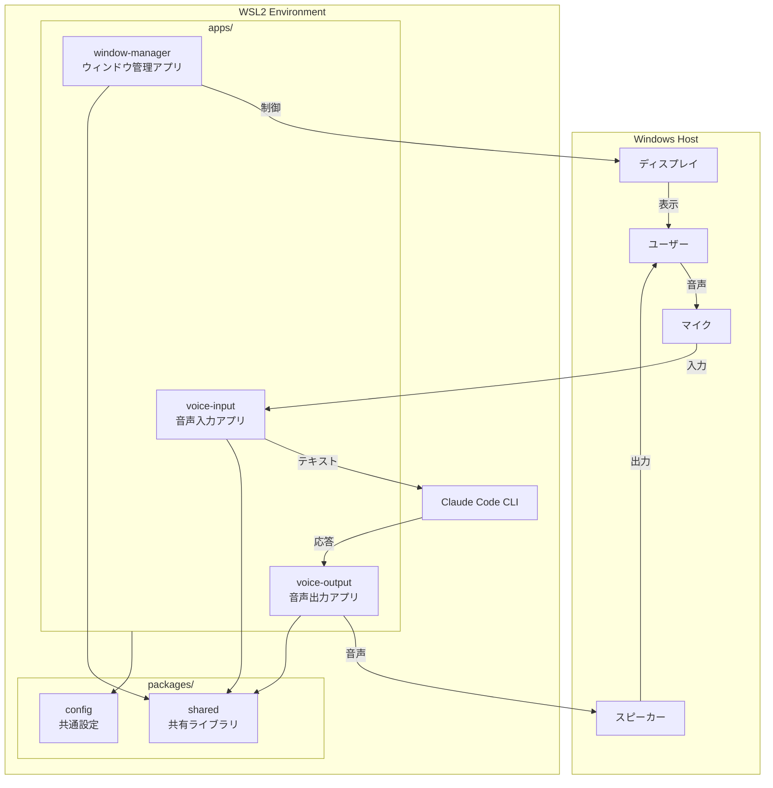
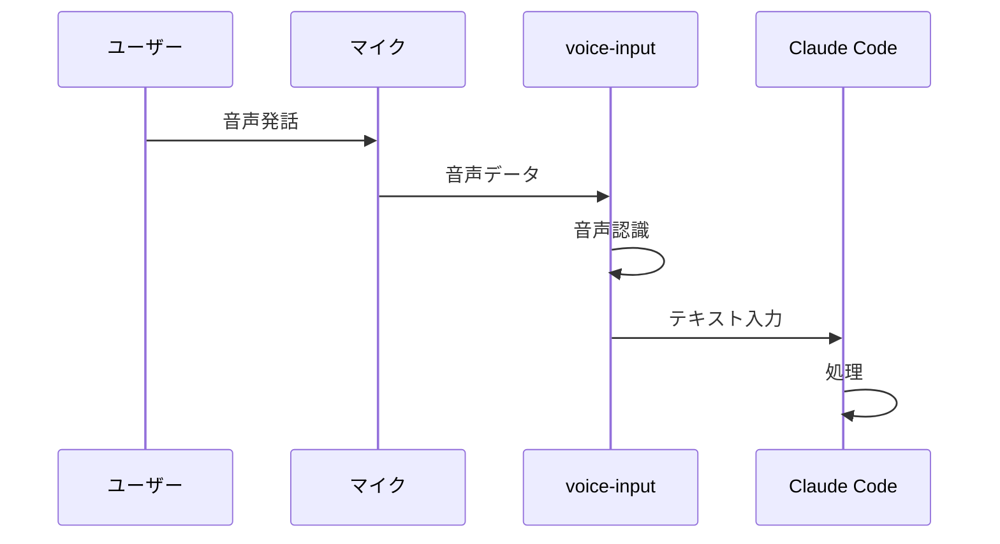
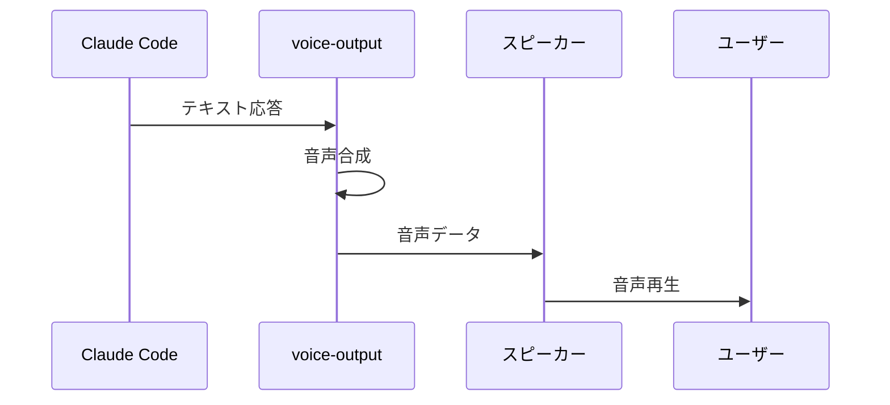
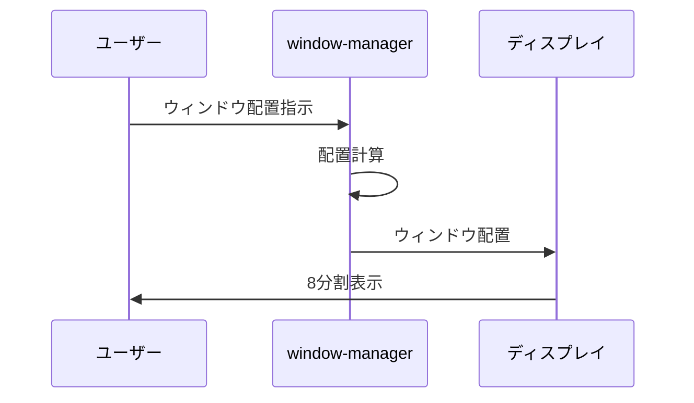

# システムアーキテクチャ

## 概要

WSL Claude Commanderは、WSL2上のClaude Codeを音声入出力とマルチウィンドウで操作するためのツール群です。モノレポ構成で複数のアプリケーションを管理します。

## システム全体図



## ディレクトリ構造

```
wsl-claude-commander/
├── apps/                     # アプリケーション
│   ├── voice-input/          # 音声入力アプリ（準備中）
│   ├── voice-output/         # 音声出力アプリ（準備中）
│   └── window-manager/       # ウィンドウ管理アプリ（準備中）
├── packages/                 # 共有パッケージ
│   ├── shared/               # 共有ライブラリ（準備中）
│   └── config/               # 共通設定（準備中）
├── docs/                     # ドキュメント
│   ├── README.md             # ドキュメントインデックス
│   ├── ARCHITECTURE.md       # このファイル
│   ├── guide/                # ガイドライン
│   ├── knowledge/            # 実践的知識（HOW）
│   ├── design/               # 設計思想（WHY）
│   ├── references/           # 外部仕様（WHAT）
│   ├── flows/                # 処理フロー
│   ├── testing/              # テストガイド
│   └── _templates/           # ドキュメントテンプレート
├── CLAUDE.md                 # Claude Code用ガイドライン
└── README.md                 # プロジェクト説明
```

## アプリケーション一覧

| アプリ | 説明 | 状態 |
|-------|------|------|
| `voice-input` | 音声認識でClaudeにテキスト入力 | 準備中 |
| `voice-output` | Claudeの応答を音声で読み上げ | 準備中 |
| `window-manager` | WSLウィンドウの配置管理 | 準備中 |

## 技術スタック（予定）

| 領域 | 技術 |
|------|------|
| 音声認識 | (検討中) |
| 音声合成 | (検討中) |
| ウィンドウ管理 | (検討中) |
| 言語 | (検討中) |

## 重要なファイル

| ファイル | 説明 |
|---------|------|
| `/CLAUDE.md` | Claude Code用ガイドライン |
| `/README.md` | プロジェクト説明・セットアップ |
| `/docs/README.md` | ドキュメント全体のインデックス |
| `/docs/guide/documentation.md` | ドキュメント作成ガイド |

## データフロー

### 音声入力フロー



### 音声出力フロー



### マルチウィンドウフロー



## 関連ドキュメント

- [docs/README.md](./README.md) - ドキュメント全体のナビゲーション
- [docs/design/README.md](./design/README.md) - 設計思想
- [docs/guide/documentation.md](./guide/documentation.md) - ドキュメント作成ガイド
