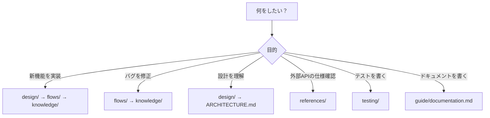
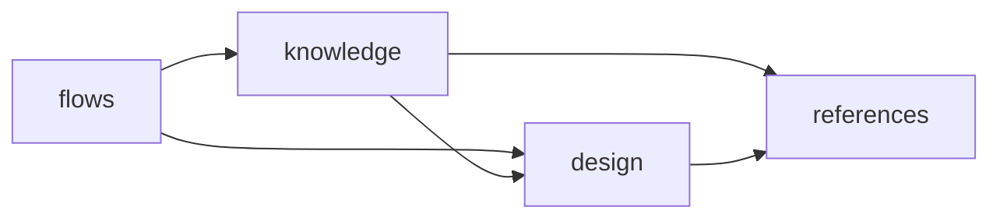

# WSL Claude Commander ドキュメント

> LLM/探索型ワークフロー最適化版ドキュメント

## クイックスタート

### 最初の30分で読むべきドキュメント

1. **[ARCHITECTURE.md](./ARCHITECTURE.md)** (10分) - システム全体のアーキテクチャ
2. **[guide/documentation.md](./guide/documentation.md)** (10分) - ドキュメント作成ガイドライン
3. 担当アプリの設計ドキュメント (10分)

### 決定木: 何を読むべきか



## ディレクトリ構造

```
docs/
├── README.md                 # このファイル（ドキュメント全体のインデックス）
├── ARCHITECTURE.md           # システムアーキテクチャガイド
├── guide/                    # ガイドライン
│   ├── README.md
│   └── documentation.md      # ドキュメント作成ガイド（LLM最適化版）
├── knowledge/                # 実践的知識（HOW）⭐⭐⭐
│   └── README.md
├── design/                   # 設計思想（WHY）⭐⭐
│   └── README.md
├── references/               # 外部仕様（WHAT）⭐
│   └── README.md
├── flows/                    # 処理フロー（WHEN/WHERE）⭐⭐⭐
│   └── README.md
├── testing/                  # テストガイド
│   └── README.md
└── _templates/               # ドキュメントテンプレート
    └── flow.md
```

## ディレクトリの役割と優先度

| ディレクトリ | 役割 | 優先度 | 読むタイミング |
|------------|------|--------|--------------|
| `knowledge/` | 実装時の注意点・ノウハウ（HOW） | ⭐⭐⭐ 必読 | 実装前に必ず確認 |
| `design/` | 設計思想・アーキテクチャ（WHY） | ⭐⭐ 理解推奨 | 新機能設計時 |
| `references/` | 外部ライブラリ仕様（WHAT） | ⭐ 必要時参照 | API仕様確認時 |
| `flows/` | 処理フロー・シーケンス（WHEN/WHERE） | ⭐⭐⭐ 実装時必須 | 機能実装・デバッグ時 |
| `testing/` | テスト実行ガイド | ⭐⭐ 実装後必須 | テスト作成・実行時 |
| `guide/` | 開発ガイドライン | ⭐⭐ 理解推奨 | ドキュメント作成時 |

## アプリケーション別ドキュメント

各アプリケーションのドキュメントは `apps/{app-name}/README.md` を参照してください。

| アプリ | 説明 | ドキュメント |
|-------|------|-------------|
| (準備中) | | |

## 相互リンクの方向性



- **flows/** → knowledge/, design/ を参照
- **knowledge/** → design/, references/ を参照
- **design/** → references/ を参照

## コンテキスト最適化ルール

1. **1ファイル = 1,000-2,000行以内**
2. **相互リンクは3-5個を目安**
3. **Frontmatterで検索性を向上**
4. **Mermaid図で視覚化**

詳細は [guide/documentation.md](./guide/documentation.md) を参照。
