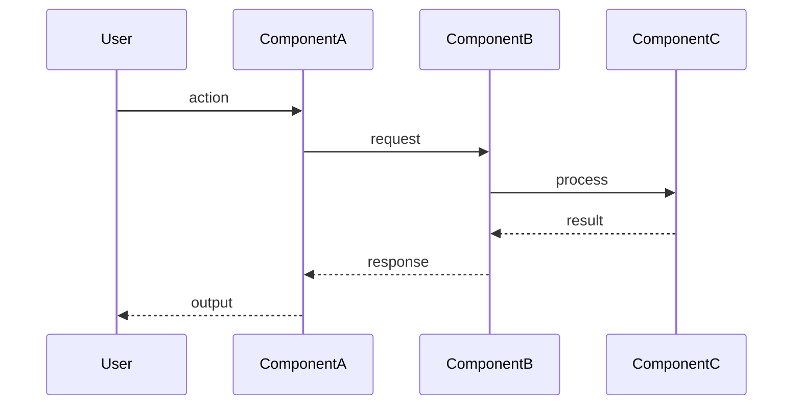

# [機能名] 処理フロー

## 概要

[この処理フローの目的を1-2文で説明]

## 入口

- **トリガー**: [何がこの処理を開始するか]
- **ファイル**: `apps/app-name/src/path/to/file.ts:123`

## 呼び出し順序

1. `functionA()` - `apps/app-name/src/path/to/fileA.ts:45`
   - [この関数の役割]
2. `functionB()` - `apps/app-name/src/path/to/fileB.ts:67`
   - [この関数の役割]
3. `functionC()` - `apps/app-name/src/path/to/fileC.ts:89`
   - [この関数の役割]

## シーケンス図

## 関連ファイル

| ファイル | 役割 |
|---------|------|
| `apps/app-name/src/path/to/file1.ts` | [役割の説明] |
| `apps/app-name/src/path/to/file2.ts` | [役割の説明] |
| `apps/app-name/src/path/to/file3.ts` | [役割の説明] |

## 入力・出力・副作用

### 入力
- [入力1の説明]
- [入力2の説明]

### 出力
- [出力1の説明]

### 副作用
- [副作用1の説明（ファイル書き込み、状態変更など）]

## 観測点（デバッグ用）

| 箇所 | 確認内容 |
|------|---------|
| `fileA.ts:50` | [何を確認すべきか] |
| `fileB.ts:70` | [何を確認すべきか] |

## エラーハンドリング

| エラー | 発生条件 | 対処 |
|--------|---------|------|
| [エラー名] | [条件] | [対処方法] |

## 補足事項

- [エッジケース1]
- [注意点1]

## 関連ドキュメント

- [関連するknowledgeドキュメント](../knowledge/xxx.md)
- [関連するdesignドキュメント](../design/xxx.md)
