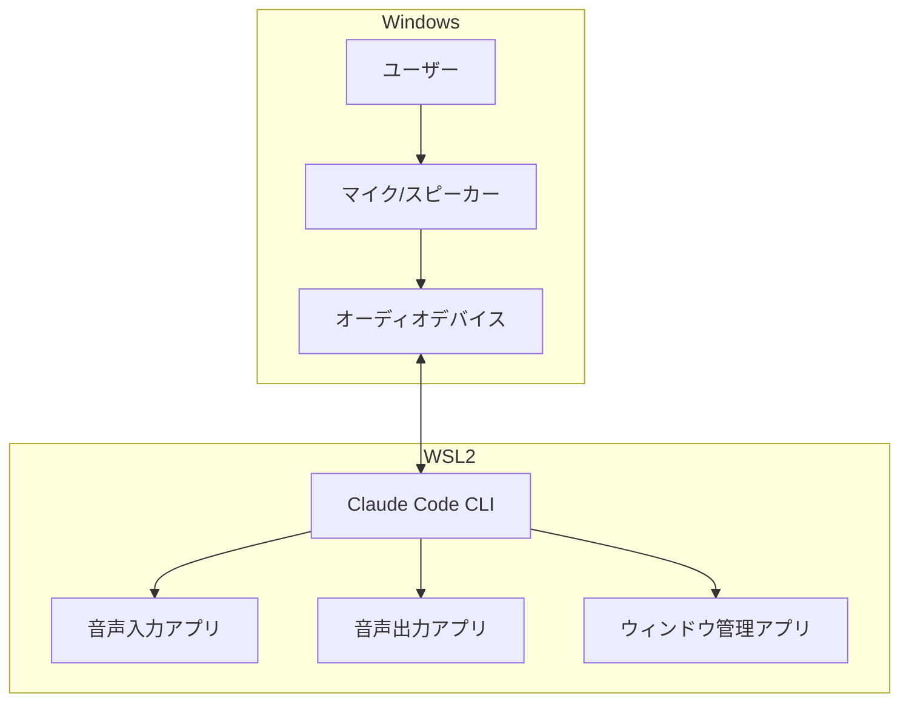

# Design（設計思想）

システムの設計判断と「なぜそう設計したか」を説明するドキュメントです。

## 優先度 ⭐⭐ 理解推奨

新機能の設計時や、既存システムの理解を深めたい場合に参照してください。

## ドキュメント一覧

| ファイル | 説明 | 優先度 |
|---------|------|--------|
| (準備中) | | |

## アーキテクチャ概要

## 関連ディレクトリ

- [../knowledge/](../knowledge/) - 実践的知識（HOW）
- [../references/](../references/) - 外部仕様（WHAT）
- [../ARCHITECTURE.md](../ARCHITECTURE.md) - 詳細アーキテクチャ
