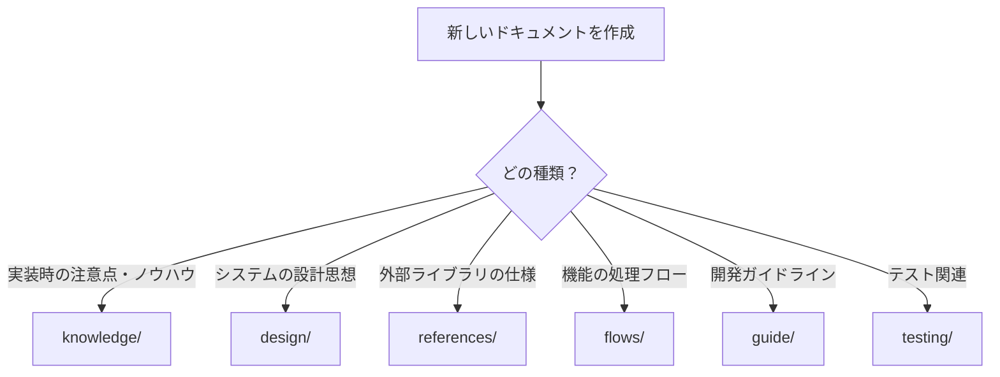
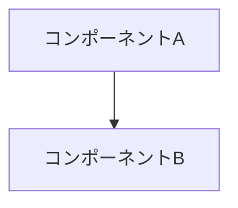
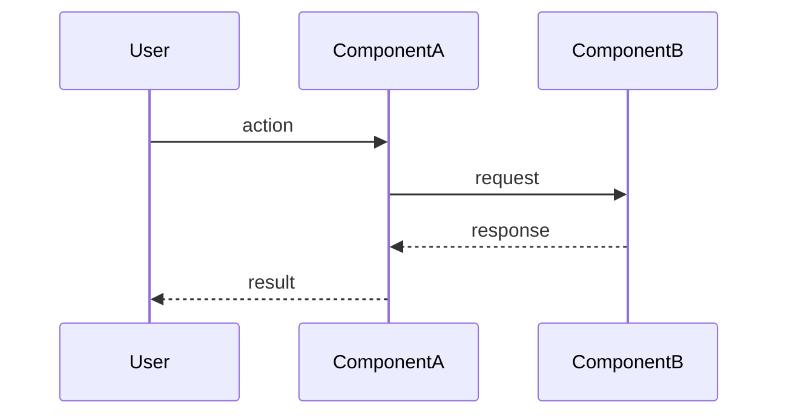
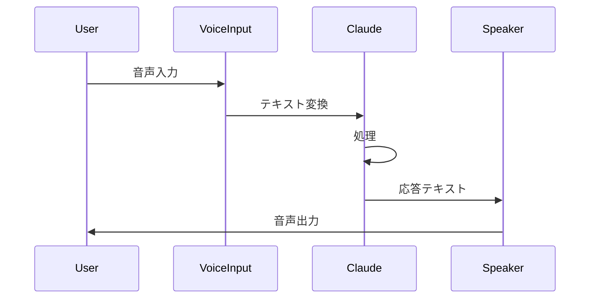

# ドキュメント作成ガイド（LLM/探索型ワークフロー最適化版）

## 基本原則

### 従来の課題

1. **コンテキスト爆発**: 巨大な単一ファイルはLLMのコンテキストを圧迫
2. **探索の非効率性**: 関連ドキュメントが分散し、必要な情報に到達できない
3. **混在する情報**: 設計・知識・手順が1つのファイルに混在
4. **優先度不明**: どのドキュメントから読むべきか不明確

### 改善後の効果

1. **コンテキスト削減**: 必要な情報のみを効率的に読み込み
2. **探索時間の短縮**: 相互リンクで関連情報に自動到達
3. **情報の明確な分類**: 目的に応じた参照が可能
4. **優先度の明示**: READMEで「何から読むべきか」を明確化

## ディレクトリ構造と役割

### ディレクトリ選択フローチャート



### 各ディレクトリの役割

| ディレクトリ | 質問 | 内容 |
|------------|------|------|
| `knowledge/` | HOW - どうやって？ | 実装時の注意点、ベストプラクティス、トラブルシューティング |
| `design/` | WHY - なぜ？ | 設計判断の理由、アーキテクチャの背景、トレードオフ |
| `references/` | WHAT - 何？ | 外部API仕様、ライブラリドキュメントの要約 |
| `flows/` | WHEN/WHERE - いつ/どこで？ | 処理フロー、シーケンス図、ファイルパス+行番号 |
| `guide/` | RULES - ルール | 開発ガイドライン、コーディング規約 |
| `testing/` | TEST - テスト | テスト実行方法、テスト設計 |

## ドキュメント種別ごとのガイドライン

### 1. Knowledge ドキュメント

**目的**: 実装時に「知らないとハマる」情報を提供

**構造**:
```markdown
---
title: [タイトル]
category: knowledge
tags: [tag1, tag2, tag3]
related:
  - ../design/related-doc.md
  - ../flows/related-flow.md
---

# タイトル

## なぜ必要か
[この知識が必要な背景・問題]

## 内容
[詳細な説明]

## ベストプラクティス
[推奨される実装方法]

## アンチパターン
[避けるべき実装方法]

## トラブルシューティング
[よくある問題と解決策]

## 関連ドキュメント
- [関連ドキュメント1](../path/to/doc1.md)
- [関連ドキュメント2](../path/to/doc2.md)
```

**チェックリスト**:
- [ ] 実際のコード例がある
- [ ] ベストプラクティスとアンチパターンを明示
- [ ] 「なぜ」そうすべきかの説明がある
- [ ] トラブルシューティングセクションがある

### 2. Design ドキュメント

**目的**: システムの設計判断と「なぜそう設計したか」を説明

**構造**:
```markdown
---
title: [タイトル]
category: design
tags: [tag1, tag2, tag3]
related:
  - ../references/related-spec.md
---

# タイトル

## 設計の背景
[この設計が必要になった背景・課題]

## アーキテクチャ概要



## 設計判断
[なぜこの設計を選んだか]

## トレードオフ
| 利点 | 欠点 |
|-----|-----|
| ... | ... |

## 代替案
[検討した他の選択肢と却下理由]

## 関連ドキュメント
```

**チェックリスト**:
- [ ] 「なぜ」この設計にしたかの説明
- [ ] Mermaid図で全体像を可視化
- [ ] トレードオフ（利点と欠点）を明記
- [ ] 代替案との比較がある

### 3. References ドキュメント

**目的**: 外部ライブラリの仕様を整理

**構造**:
```markdown
---
title: [タイトル]
category: reference
tags: [tag1, tag2, tag3]
source: [元のURL]
downloaded: [取得日 YYYY-MM-DD]
related: []
---

# タイトル

> **注意**: このドキュメントは外部仕様の要約です。最新情報は[公式ドキュメント](URL)を参照してください。

## Quickstart
[クイックスタートガイド]

## 主要API
[よく使うAPIの説明]

## Known Issues
[既知の問題・注意点]
```

**チェックリスト**:
- [ ] 元のURLと取得日を明記
- [ ] 要約・抜粋であることを明記
- [ ] 「最新情報は公式参照」と注意書き
- [ ] 2,000行以下に抑える

### 4. Flow ドキュメント

**目的**: 機能の処理フローを時系列で説明

**構造**:
```markdown
---
title: [機能名] 処理フロー
category: flow
tags: [tag1, tag2, tag3]
related:
  - ../knowledge/related-knowledge.md
  - ../design/related-design.md
---

# [機能名] 処理フロー

## 概要
[この処理フローの目的]

## 入口
- **トリガー**: [何がこの処理を開始するか]
- **ファイル**: `path/to/file.ts:123`

## 呼び出し順序

1. `functionA()` - `path/to/fileA.ts:45`
2. `functionB()` - `path/to/fileB.ts:67`
3. `functionC()` - `path/to/fileC.ts:89`

## シーケンス図



## 関連ファイル

| ファイル | 役割 |
|---------|------|
| `path/to/file1.ts` | 説明1 |
| `path/to/file2.ts` | 説明2 |

## 観測点（デバッグ用）
[ログ出力箇所、ブレークポイント推奨箇所]

## 補足事項
[エッジケース、注意点]
```

**チェックリスト**:
- [ ] ファイルパス+行番号で正確な参照
- [ ] 時系列の呼び出し順を明記
- [ ] 入力・出力・副作用を明確に
- [ ] Mermaidシーケンス図がある
- [ ] 関連ファイルを網羅的にリスト化

## Frontmatter 設定

### 必須フィールド

```yaml
---
title: ドキュメントのタイトル
category: knowledge | design | reference | flow | guide | testing
tags: [tag1, tag2, tag3]  # 最低3つ、最大10個
related:
  - ../relative/path/to/doc1.md
  - ../relative/path/to/doc2.md
---
```

### タグ命名規則

- **アプリ系**: `voice-input`, `voice-output`, `multi-window`
- **技術系**: `wsl`, `audio`, `speech-recognition`, `tts`, `window-management`
- **機能系**: `microphone`, `speaker`, `display`, `configuration`
- **分類系**: `error-handling`, `resource-management`, `best-practices`, `architecture`

### オプションフィールド

- **References専用**: `source`, `downloaded`
- **Knowledge専用**: `deprecated`, `superseded_by`

## 相互リンクの戦略

### リンク方向性

```
flows/ → knowledge/, design/
knowledge/ → design/, references/
design/ → references/
```

### リンクを張るべきタイミング

| 状況 | リンク先 | 例 |
|------|---------|-----|
| 実装時の注意点 | knowledge/ | 音声ストリームのクリーンアップ |
| 設計の背景 | design/ | なぜマルチウィンドウを使うか |
| API仕様 | references/ | 音声認識APIの引数 |
| 前後の処理 | flows/ | 初期化後の処理 |

### リンク数の目安

- **最低**: 2つ（孤立ドキュメントを作らない）
- **推奨**: 3-5つ（関連性の高いものを厳選）
- **最大**: 10つ（多すぎるとノイズになる）

## コンテキストサイズの最適化

### 原則: 1ファイル = 1,000-2,000行以内

### ファイル分割の判断基準

```
< 1,000行      → そのまま
1,000-2,000行  → OK（推奨範囲）
2,000-5,000行  → 分割を検討
> 5,000行      → 必ず分割
```

### 分割戦略

1. **トピック別分割**: 大きなドキュメントを論理的な単位で分割
2. **優先度別分割**:
   - ⭐⭐⭐ 必読
   - ⭐⭐ 実装時参照
   - ⭐ 詳細が必要な場合

## Mermaid図の活用

### 使用すべき場面

1. **システム全体のアーキテクチャ** (design/) - `graph TD`
2. **処理フロー** (flows/) - `sequenceDiagram`
3. **状態遷移** (knowledge/) - `stateDiagram-v2`
4. **決定木** (README) - `graph TD`

### 例: シーケンス図



## READMEの役割

各ディレクトリのREADMEは以下を含める:

1. **ディレクトリの目的**
2. **ファイル一覧と優先度**
3. **クイックナビゲーション**
4. **関連ディレクトリへのリンク**
