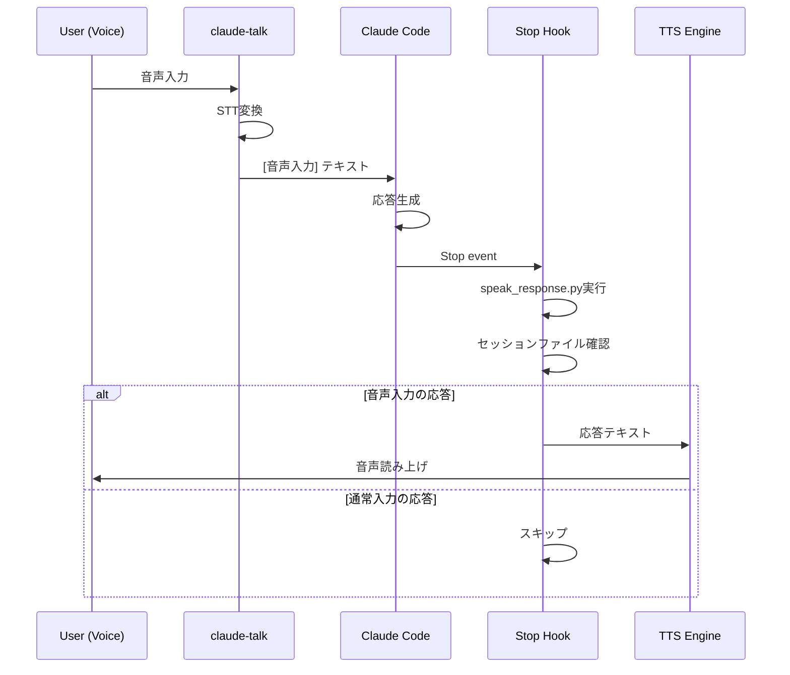

# Claude Code Hooks設定ガイド

## 概要

Claude Codeには「Hooks」という機能があり、特定のイベント発生時にカスタムコマンドを実行できます。
claude-talkでは、この機能を使って音声入力への応答を自動読み上げします。

## 利用可能なHooks

| Hook名 | 発火タイミング |
|--------|----------------|
| Stop | Claudeの応答が完了したとき |
| Notification | 通知が発生したとき |

## 設定ファイル

Hooksは `~/.claude/settings.json` で設定します。

```json
{
  "hooks": {
    "Stop": [
      {
        "hooks": [
          {
            "type": "command",
            "command": "コマンド1"
          },
          {
            "type": "command",
            "command": "コマンド2"
          }
        ]
      }
    ]
  }
}
```

## claude-talk応答読み上げの設定

### 前提条件

1. claude-talkがインストール済み
2. 音声入力時に `[音声入力]` プレフィックスが付与される設定

### 設定手順

1. `~/.claude/settings.json` を編集
2. Stop hookに `speak_response.py` を追加

```json
{
  "hooks": {
    "Stop": [
      {
        "hooks": [
          {
            "type": "command",
            "command": "python3 /path/to/claude-talk/scripts/speak_response.py"
          }
        ]
      }
    ]
  }
}
```

### 動作フロー



### 仕組み

`speak_response.py` は以下の処理を行います：

1. 最近のセッションファイル（`~/.claude/projects/*/sessionId.jsonl`）を検索
2. `[音声入力]` プレフィックス付きのユーザーメッセージを探す
3. 該当メッセージの次のアシスタント応答を取得
4. Edge TTSで読み上げ

### 関連スクリプト

| ファイル | 役割 |
|---------|------|
| `scripts/read_response.py` | セッションから応答を検出 |
| `scripts/speak_response.py` | 応答をTTSで読み上げ |

## 複数Hookの組み合わせ

終了音とTTS読み上げを組み合わせる例：

```json
{
  "hooks": {
    "Stop": [
      {
        "hooks": [
          {
            "type": "command",
            "command": "powershell.exe -NoProfile -ExecutionPolicy Bypass -File 'D:\\path\\to\\play_finish.ps1'"
          },
          {
            "type": "command",
            "command": "python3 /path/to/claude-talk/scripts/speak_response.py"
          }
        ]
      }
    ]
  }
}
```

## トラブルシューティング

### 読み上げが実行されない

1. セッションファイルのパスを確認
   ```bash
   ls -la ~/.claude/projects/
   ```

2. スクリプトを直接実行してテスト
   ```bash
   python3 /path/to/scripts/speak_response.py
   ```

### 音声入力以外も読み上げられる

`[音声入力]` プレフィックスが正しく付与されているか確認：
```bash
tail -1 ~/.claude/projects/*/sessionId.jsonl | jq .
```

## 関連ドキュメント

- [claude-talk README](../../apps/claude-talk/README.md)
- [Claude Code公式ドキュメント](https://docs.anthropic.com/claude-code/)
